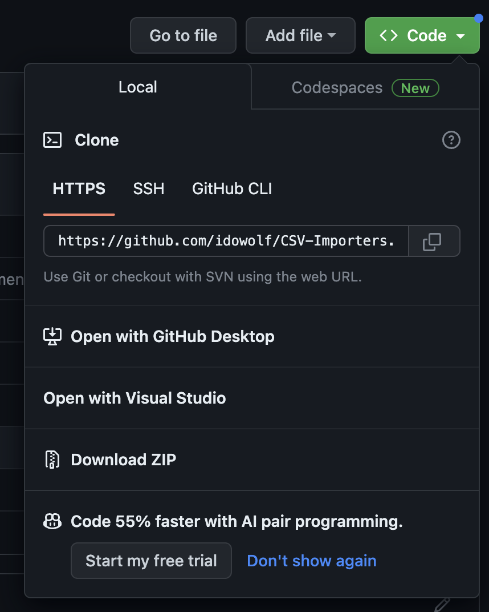
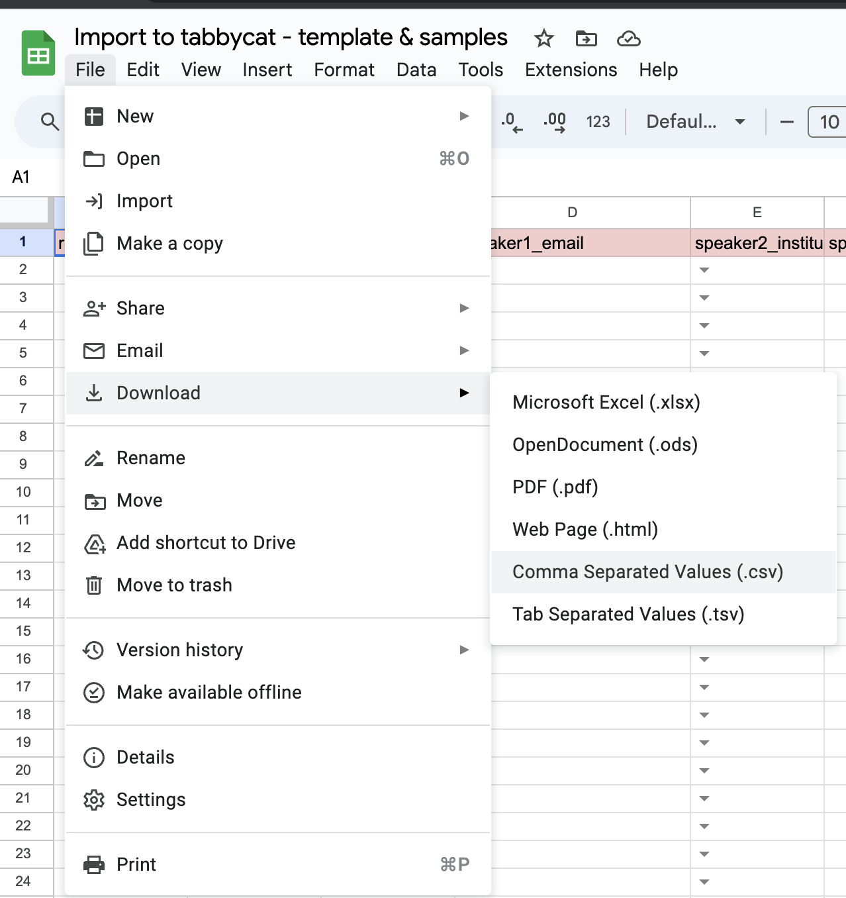

<strong>מדריך שימוש</strong>

1. קבלו מעידו פרטי התחברות ל-[http://idltournaments2024.calicotab.com/](http://idltournaments2024.calicotab.com/)
2. צרו את הטורניר שלכם. עצרו לפני הזנת שופטים וקבוצות.
3. באתר שבו אתם נמצאים עכשיו, לחצו על Code > Download ZIP למעלה: 

4. פרסו את קובץ ה-ZIP בתיקייה במחשב לבחירתכם
5. פתחו את הקובץ index.html בדפדפן החביב עליכם
6. תחת Tabbycat URL יש לכתוב [http://idltournaments2024.calicotab.com/](http://idltournaments2024.calicotab.com/)
7. אין צורך למלא את Tournament name, אך מומלץ לכתוב אותו, בדיוק כפי שכתבתם את שם הטורניר המלא ביצירת הטורניר
8. תחת Slug יש לכתוב את מה שציינתם בתור Slug ביצירת הטורניר. כדי למצוא את זה, כנסו ל-public area של הטורניר, ותראו מה כתוב בסוף כתובת ה-URL. למשל בתחרות הדיסטופיה ה-URL המלא הוא [http://idltournaments2024.calicotab.com/dystopia2023/](http://idltournaments2024.calicotab.com/dystopia2023/) ולכן ה-Slug הוא "dystopia2023" ללא מרכאות.
9. כדי למצוא את ה-API token, התחברו למשתמש שלכם באתר [http://idltournaments2024.calicotab.com/](http://idltournaments2024.calicotab.com/). גללו בדף הראשי למטה עד הסוף, שם תראו את הכפתור הבא: 

10. לחצו על הכפתור. בראש הדף יופיע ה-token שלכם: 

11. העתיקו את הטקסט שמסומן בצילום הזה באדום והדביקו אותו לדף של ה-importer.
12. צרו עותק של דף Google Sheets הבא: [https://docs.google.com/spreadsheets/d/1r5JwdSFTpOykkyy1EvtpyP4oDWVGvQ7a_Bx1AKQqvp0/edit?usp=sharing](https://docs.google.com/spreadsheets/d/1r5JwdSFTpOykkyy1EvtpyP4oDWVGvQ7a_Bx1AKQqvp0/edit?usp=sharing)
13. בהעתק שלכם, מלאו את הגיליונות teams ו-adjudicators לפי התבנית. מומלץ להיעזר בגיליונות לדוגמה teams_sample ו-adjudicators_sample
    1. שימו לב - 'reference' זהו שם הקבוצה
    2. לא חובה למלא score על השופטים. ניתן להשאיר ריק (אם לא מילאתם בתהליך הזה תמיד אפשר לערוך את הניקוד רטרואקטיבית ב-Edit Database)
    3. יש לכלול את גם את האייטים (מי מהם שמגיעים ביום התחרות לשפוט) בטבלת השופטים. יש לכתוב V תחת עמודת adj_core לצד חברי האייטים.
    4. שמות המוסדות צריכים להתאים בדיוק לשמות המוסדות בגיליון list_of_institutions. לנוחותכם הטופס כולל בדיקת נתונים, מומלץ גם ליצור מראש את טפסי הרישום עם רשימה סגורה של מוסדות שכתובים בדיוק ככה.
14. עבור כל אחד מהגיליונות teams ו-adjudicators, לחצו על File> Download > Comma Separated Values - CSV.

15. שנו את שמות הגיליונות במחשב שלכם ל-teams.csv ו-adjudicators.csv בהתאמה (שלא יהיה שום תו מיותר בשם הקובץ! זה חשוב!)
16. חזרו לדף index.html שפתחתם קודם, לחצו על כפתור Choose Files, ובחרו את שני הקבצים teams.csv ו-adjudicators.csv שהורדתם מגוגל דרייב. לאחר שתעלו את הקבצים, לצד השדה CSV Files צריך להיות כתוב "2 files":

17. לחצו על Submit ותהליך הזנת הנתונים יתחיל. בהצלחה!